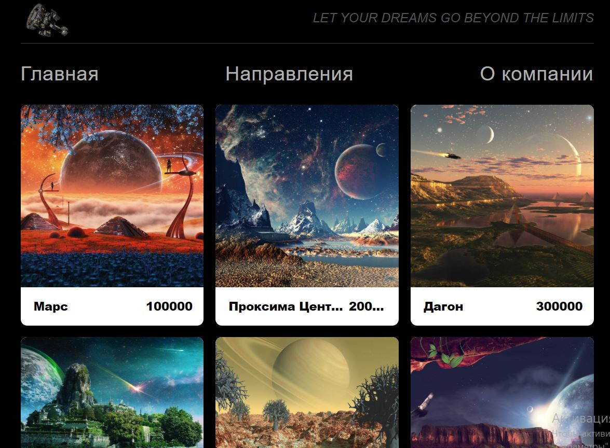

# my-voyage

Страница выполена в качестве итогового задания по курсу «Python-разработчик: web-приложения с нуля»

Вариант 2: "Разработать WEB приложение по поиску мест для путешествий".

Стек: HTML, Python, Flask, SQLite.

Скрин страницы:
